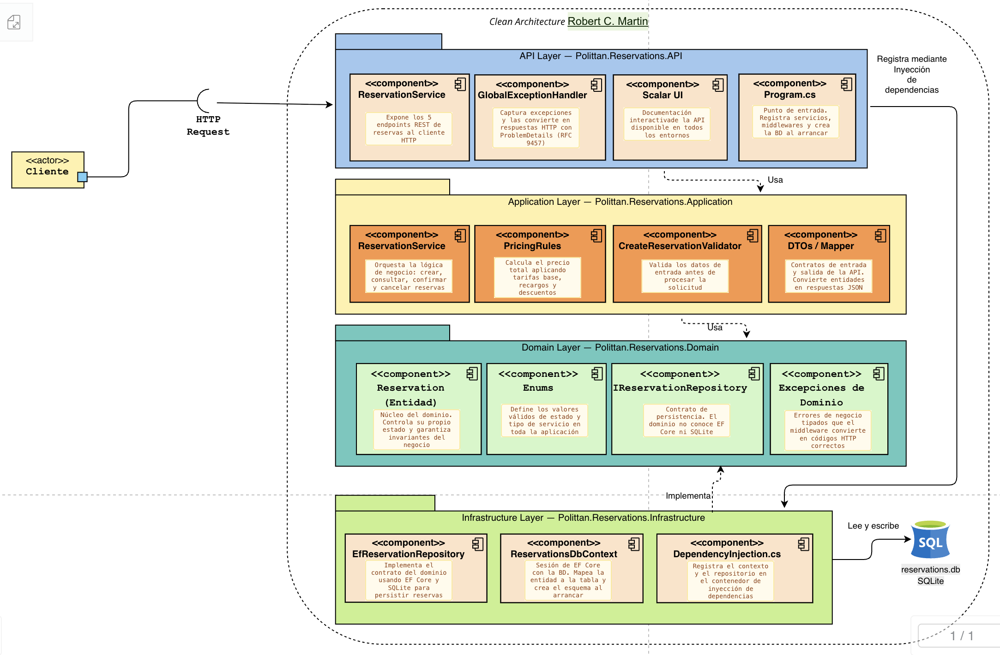
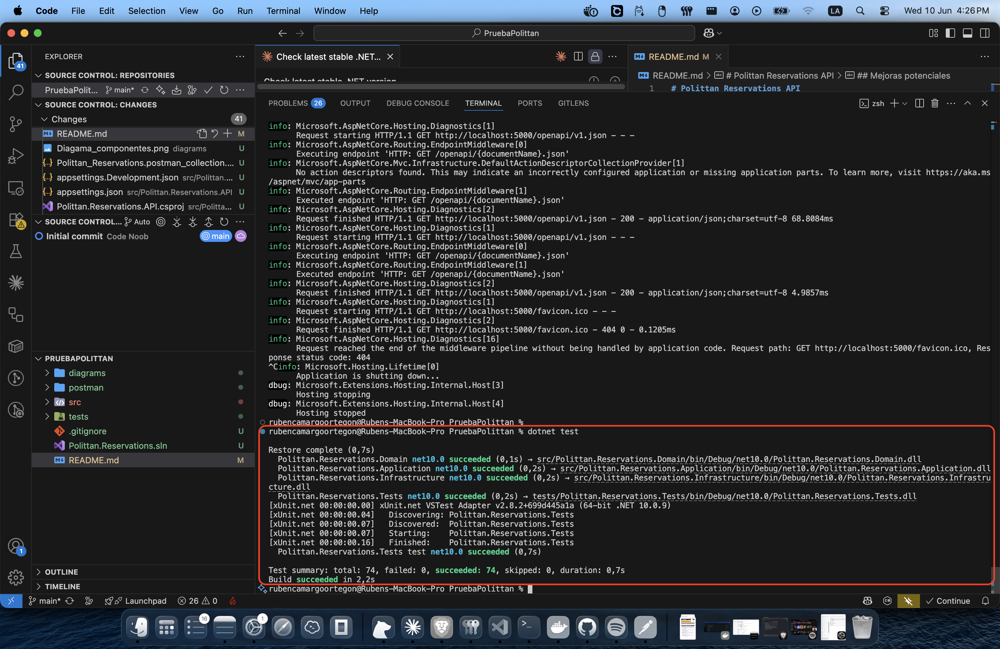

# Polittan Reservations API

API REST para gestión de reservas de traslados — Prueba técnica Backend .NET Senior.

**Autor:** Rubén Eduardo Camargo Ortegón  
**Stack:** .NET 10 · Minimal APIs · Clean Architecture · EF Core · SQLite · FluentValidation · Scalar UI

---

## Arquitectura

**Clean Architecture** — dependencias solo hacia adentro: `API → Application → Domain ← Infrastructure`.

### Diagrama de componentes



---

## Requisitos

- [.NET 10 SDK](https://dotnet.microsoft.com/download/dotnet/10.0)

---

## Correr el proyecto

```bash
# Desde la raíz del repositorio
dotnet run --project src/Polittan.Reservations.API
```

Al iniciar, la app:
1. Crea `reservations.db` automáticamente si no existe
2. Genera la tabla `Reservations` y su índice
3. Queda lista en `http://localhost:5000`

**No se requiere ningún paso adicional.** La BD se crea sola en el primer arranque.

---

## Supuestos

1. La detección de "mismo día" y "2+ días de anticipación" compara fechas en UTC.
2. Los precios se calculan y persisten al crear; tarifas futuras no afectan reservas existentes.
3. El archivo `reservations.db` se crea junto al ejecutable (`bin/Debug/...`).
4. No se implementó autenticación porque la prueba no lo solicita.

---

## Mejoras potenciales

- Cambiar SQLite por **PostgreSQL / SQL Server** (solo requiere cambiar el provider en `DependencyInjection.cs`).
- Autenticación JWT / OAuth2.
- Paginación en `GET /reservations`.
- Tests de integración con `WebApplicationFactory` + SQLite en memoria.
- Pipeline CI/CD
- Health checks (`/health`).
- Inyectar `TimeProvider` en lugar de `DateTime.UtcNow` para testabilidad total.

---

## Documentación interactiva (Swagger / Scalar)

| URL | Descripción |
|-----|-------------|
| `http://localhost:5000/scalar/v1` | **UI interactiva Scalar** (reemplaza Swagger UI en .NET 10) |
| `http://localhost:5000/openapi/v1.json` | JSON OpenAPI 3.1 raw |

> Disponible en todos los entornos (Development y Production) siempre que la app esté corriendo.

---

## Endpoints

| Método | Ruta | Descripción | Respuestas |
|--------|------|-------------|------------|
| `POST` | `/reservations` | Crear reserva | `201` / `400` / `409` |
| `GET` | `/reservations` | Listar todas las reservas | `200` |
| `GET` | `/reservations/{id}` | Obtener reserva por ID | `200` / `404` |
| `PATCH` | `/reservations/{id}/confirm` | Confirmar reserva | `200` / `404` / `422` |
| `PATCH` | `/reservations/{id}/cancel` | Cancelar reserva | `200` / `404` / `422` |

---

## Ejemplo de petición

```bash
curl -X POST http://localhost:5000/reservations \
  -H "Content-Type: application/json" \
  -d '{
    "customerName": "Juan Pérez",
    "origin": "Bogotá",
    "destination": "Aeropuerto El Dorado",
    "date": "2027-04-20T10:00:00",
    "passengers": 3,
    "serviceType": "standard"
  }'
```

Respuesta `201 Created`:
```json
{
  "id": "3fa85f64-5717-4562-b3fc-2c963f66afa6",
  "customerName": "Juan Pérez",
  "origin": "Bogotá",
  "destination": "Aeropuerto El Dorado",
  "date": "2027-04-20T10:00:00",
  "passengers": 3,
  "serviceType": "Standard",
  "status": "Created",
  "totalPrice": 76000.00,
  "createdAt": "2026-06-10T12:00:00Z"
}
```

---

## Base de datos (SQLite)

| Parámetro | Valor |
|-----------|-------|
| Motor | SQLite (via EF Core 9) |
| Archivo | `src/Polittan.Reservations.API/reservations.db` |
| Cadena de conexión | `appsettings.json` → `ConnectionStrings:DefaultConnection` |
| Creación | Automática con `EnsureCreated` al primer `dotnet run` |

### Comportamiento automático de la BD

La base de datos **no se incluye en el repositorio** (está en `.gitignore`). Al correr la app por primera vez, EF Core la crea automáticamente:

```
dotnet run  →  reservations.db creado  →  tabla Reservations lista  →  API operativa
```

No se requiere ningún comando adicional (`dotnet ef`, migraciones, scripts SQL).

### Esquema de la tabla `Reservations`

| Columna | Tipo | Descripción |
|---------|------|-------------|
| `Id` | TEXT (GUID) | PK — generado por la aplicación |
| `CustomerName` | TEXT (max 150) | Nombre del cliente |
| `Origin` | TEXT (max 200) | Ciudad de origen |
| `Destination` | TEXT (max 200) | Ciudad de destino |
| `Date` | TEXT (ISO 8601) | Fecha y hora del traslado |
| `Passengers` | INTEGER | Número de pasajeros (1–6) |
| `ServiceType` | TEXT | `Standard` o `Premium` |
| `Status` | TEXT | `Created`, `Confirmed` o `Cancelled` |
| `TotalPrice` | TEXT | Precio calculado en COP |
| `CreatedAt` | TEXT (ISO 8601) | Timestamp UTC de creación |

Índice compuesto `IX_Reservations_Duplicate` sobre `(CustomerName, Origin, Destination, Date, ServiceType)` para detección eficiente de duplicados.

---

## Colección Postman

La colección está en [postman/Polittan_Reservations.postman_collection.json](postman/Polittan_Reservations.postman_collection.json).

### Importar

1. Abrir Postman → **Import** → arrastrar el archivo `Polittan_Reservations.postman_collection.json`.
2. La variable `{{baseUrl}}` ya está configurada en `http://localhost:5000`.

### Peticiones incluidas

| # | Nombre | Método | Ruta | Descripción |
|---|--------|--------|------|-------------|
| 1 | Create Reservation (Standard) | POST | `/reservations` | Crea reserva estándar · guarda `{{reservationId}}` automáticamente |
| 2 | Create Reservation (Premium) | POST | `/reservations` | Crea reserva premium con 4 pasajeros |
| 3 | Create Reservation (Error — mismo origen/destino) | POST | `/reservations` | Espera `400` |
| 4 | Create Reservation (Error — pasajeros fuera de rango) | POST | `/reservations` | Espera `400` |
| 5 | Get All Reservations | GET | `/reservations` | Lista todas |
| 6 | Get Reservation by ID | GET | `/reservations/{{reservationId}}` | Requiere haber ejecutado #1 |
| 7 | Get Reservation by ID (Not Found) | GET | `/reservations/00000000-...` | Espera `404` |
| 8 | Confirm Reservation | PATCH | `/reservations/{{reservationId}}/confirm` | Espera `Confirmed` |
| 9 | Cancel Reservation | PATCH | `/reservations/{{reservationId}}/cancel` | Espera `Cancelled` |

Cada petición incluye **tests automáticos de Postman** que verifican status code y campos de la respuesta.

### Flujo recomendado

1. **Crear reserva** — ejecuta `Create Reservation (Standard)`, guarda el ID automáticamente
2. **Listar todas** — ejecuta `Get All Reservations`, verifica que aparece la reserva creada
3. **Buscar por ID** — ejecuta `Get Reservation by ID`, verifica los datos de la reserva
4. **Confirmar** — ejecuta `Confirm Reservation`, el estado cambia a `Confirmed`
5. **Cancelar** — ejecuta `Cancel Reservation`, el estado cambia a `Cancelled`

---

## Reglas de precio

| Regla | Valor |
|-------|-------|
| Base Standard | 50.000 COP |
| Base Premium | 80.000 COP |
| Por pasajero | +10.000 COP |
| Mismo día | +20% |
| Más de 4 pasajeros | +15% |
| Premium + más de 3 pasajeros | +10% adicional |
| Reserva con 2+ días de anticipación | −5% |

Las reglas de porcentaje se aplican **acumulativamente** en este orden: pasajeros → mismo día → grupo grande → premium grupo → descuento anticipado.

---

## Estados de reserva

```
Created ──► Confirmed
   │              │
   └──────────────┴──► Cancelled
```

- Solo se puede **confirmar** desde `Created`.
- Se puede **cancelar** desde `Created` o `Confirmed`.

---

## Validaciones

- Todos los campos son obligatorios.
- `passengers`: entre 1 y 6.
- `date`: debe ser futura.
- `origin` ≠ `destination` (case-insensitive).
- `serviceType`: `"standard"` o `"premium"` (case-insensitive).
- No se permiten reservas duplicadas (mismo cliente + origen + destino + fecha + tipo).

---

## Pruebas unitarias

### Correr los tests

```bash
# Desde la raíz del proyecto
dotnet test

# Con detalle de cada test
dotnet test --logger "console;verbosity=detailed"
```

### Resultado esperado

```
Test Run Successful.
Total tests: 74
     Passed: 74
 Total time: ~0.5 Seconds
```



### Cobertura por clase

| Clase bajo prueba | Archivo de tests | Tests |
|---|---|---|
| `PricingRules` | `tests/.../Pricing/PricingRulesTests.cs` | 14 — base, recargos, descuento, combinaciones |
| `Reservation` (entidad) | `tests/.../Domain/ReservationEntityTests.cs` | 10 — creación, Confirm, Cancel y guards |
| `CreateReservationValidator` | `tests/.../Validators/CreateReservationValidatorTests.cs` | 18 — cada campo y regla por separado |
| `ReservationService` | `tests/.../Services/ReservationServiceTests.cs` | 16 — flujos felices y errores con NSubstitute |

### Stack de testing

| Librería | Rol |
|----------|-----|
| **xUnit** | Framework de pruebas |
| **FluentAssertions** | Aserciones legibles (`result.Should().Be(...)`) |
| **NSubstitute** | Mocks del repositorio para aislar el servicio |

---